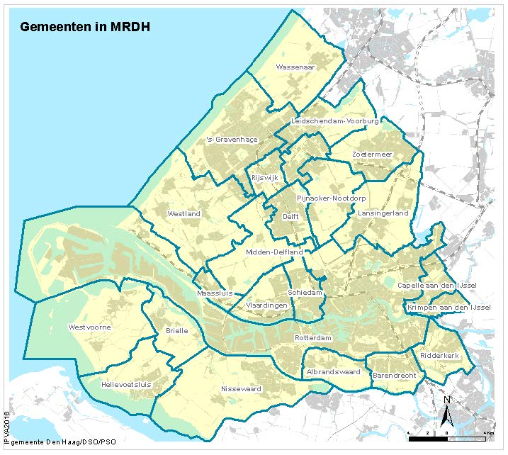

# MATSim-XCARCITY for the MRDH region in the Netherlands

The MATSim part of the Activity- and Agent-based Co-simulation framework in the paper "An Activity-and Agent-based Co-Simulation Framework for the Metropolitan Rotterdam The Hague Region (https://www.sciencedirect.com/science/article/pii/S1877050925008609)".

Detailed generation of the synthetic travel demand from the output of ActivitySim can be found in another repository: https://github.com/jingjunL/Transforming-ActivitySim-Output-into-MATSim-Input (where the core concept is to transform the trip.csv from ActivitySim to the synthetic travel demand on spatial-coordinate and time-second level)

## Java Version

The project uses Java 18.  Usually a suitable SDK is packaged within IntelliJ or Eclipse. Otherwise, one must install a
suitable sdk manually, which is available in https://openjdk.java.net/

## Scenario introduction

The scenario is for the MATSim MRDH scenario (https://en.wikipedia.org/wiki/Rotterdam%E2%80%93The_Hague_metropolitan_area) in the Netherlands. 

An ActivitySim model was generated for the region in the paper "Sustainable mobility strategies and their impact: a case study using a multimodal activity based model" (https://www.sciencedirect.com/science/article/pii/S2213624X22002450).
However, ActivitySim is based on zone-level analysis. In order to have more detailed mesoscopic traffic assignment, 
the trip file from ActivitySim has been transferred into synthetic travel demand suitable for MATSim simulation in another repository.

## Get the synthetic travel demand in the format of MATSim plan.xml

After obtaining the csv file the repo for transforming the output of ActivitySim trip into MATSim plan, in order to transform the csv into matsim plan.xml,
first need to run the script [PlanTransferWithDRT_step1](./src/main/java/org/matsim/activitySimtoMATSim/planTransfer.java).

After this step, you will obtain the MATSim plan.xml. The coming step would be get your MATSim network from OpenStreetMap and GTFS public transit schedule.

## Running MATSim MRDH Scenario

After network and PT Schedule is ready, the respective class for running MATSim is [RunMRDH](./src/main/java/org/matsim/project/runMRDHScenario.java)

## Skim Matrices Analysis

The output of MATSim does not directly have skim matrices. However, in the co-simulation framework, skim matrices are required for the loop from MATSim to ActivitySim.

We used MATSim SBB extension (https://github.com/SchweizerischeBundesbahnen/matsim-sbb-extensions) for skim matrices calculation.

The relevant code for skim matrices calculation is in [PlanTransferWithDRT_step1](./src/main/java/org/matsim/listener/skimCalculationOnHPC.java)